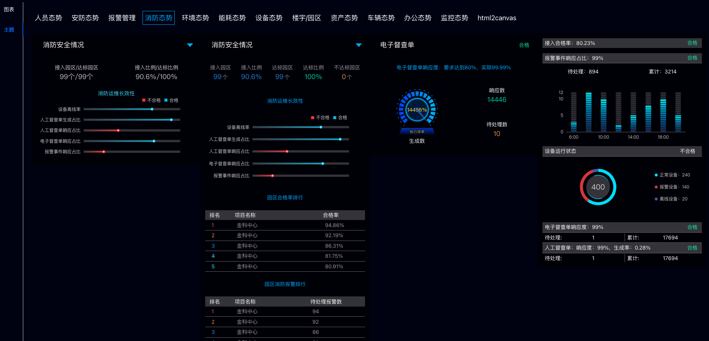

# f-charts

## Project setup
```
npm install
```

### Compiles and hot-reloads for development
```
npm run serve
```

### Compiles and minifies for production
```
npm run build
```

### Lints and fixes files
```
npm run lint
```
### 预览地址
```
http://8.130.29.31:9000/fechart/#/
```
### 组件说明

我们的组件库通过深度整合 ECharts，实现了对柱状图、折线图、饼状图等多种图表类型的高效二次封装。这一封装不仅简化了数据的处理流程，还极大地提升了图表的渲染效率和用户体验。我们的目标是打造一个功能全面、使用便捷、易于集成的图表解决方案。

### 核心优势：

1. **统一数据接口**：通过标准化的数据输入接口，确保了数据的一致性和准确性，降低了数据处理的复杂性。
2. **丰富的图表类型**：支持柱状图、折线图、饼状图等多种图表类型，满足不同场景的展示需求。
3. **高度可定制**：提供丰富的配置选项，用户可以轻松调整图表的样式、颜色、大小等，以适应不同的设计需求。
4. **易于集成**：组件库设计考虑了易用性，只需简单引用即可快速集成到任何项目中。
5. **响应式设计**：图表支持响应式布局，能够自适应不同设备和屏幕尺寸，确保在各种环境下都能保持良好的展示效果。
6. **交互性增强**：增强了图表的交互功能，如工具提示、数据缩放、图例控制等，提升了用户的交互体验。
7. **性能优化**：针对大数据量进行了性能优化，确保图表在处理大量数据时依然能够保持流畅的渲染速度。

### 使用场景：

- **数据分析报告**：快速生成数据报告，直观展示数据趋势和分布。
- **业务监控仪表板**：实时监控业务指标，及时发现问题并作出响应。
- **市场研究**：分析市场数据，辅助决策制定。
- **用户行为分析**：深入理解用户行为，优化产品设计。

我们的组件库旨在为开发者提供一个强大而灵活的工具，以简化图表的创建和维护过程，让数据可视化变得更加轻松和高效。


### Customize configuration
See [Configuration Reference](https://cli.vuejs.org/config/).

### 版本说明
当前版本是我们精心打造的早期版本，它特别要求使用 Node.js 12 版本，并确保不超过 Node.js 14 版本以保证最佳的兼容性和性能。我们正积极筹备进行一次重大的迭代更新，计划采用最新的 Vue 3 和 Vite 技术栈进行全面改造。随着这一更新，Node.js 的版本也将得到持续的更新和优化，敬请期待我们的新版本发布。

### 即将到来的更新亮点：

1. **Vue 3 框架**：我们将迁移到 Vue 3，这是一个更现代、更高效的前端框架，它提供了更好的性能和更易于维护的代码结构。
2. **Vite 构建工具**：通过引入 Vite，我们将提供更快的热重载和构建性能，极大地提升开发体验。
3. **简化 ECharts 集成**：为了解决前端工程师在使用 ECharts 时可能遇到的困难，我们将提供一个参数化的调用方式，使得调用丰富的图表组件库变得简单快捷。
4. **丰富的组件库**：我们将继续扩展和优化我们的图表组件库，确保它们能够满足各种复杂的数据可视化需求。
5. **参数化调用**：用户只需传递必要的参数，即可轻松调用图表组件，无需深入了解 ECharts 的内部机制。
6. **前端友好**：我们的设计将更加注重前端开发者的体验，确保即使是不熟悉 ECharts 的开发者也能快速上手。

### 我们的目标：

- **提升开发效率**：通过简化调用流程和提供丰富的组件库，大幅提高前端开发效率。
- **优化用户体验**：确保图表的展示效果既美观又实用，提供流畅的交互体验。
- **降低技术门槛**：让前端工程师无需深入了解复杂的图表库，也能轻松实现复杂的数据可视化需求。

随着我们技术的不断进步和创新，我们承诺将带来更加强大、灵活且易于使用的前端图表解决方案。敬请期待我们的下一次迭代更新，它将为您带来前所未有的开发体验和数据可视化能力。

### 图片预览


